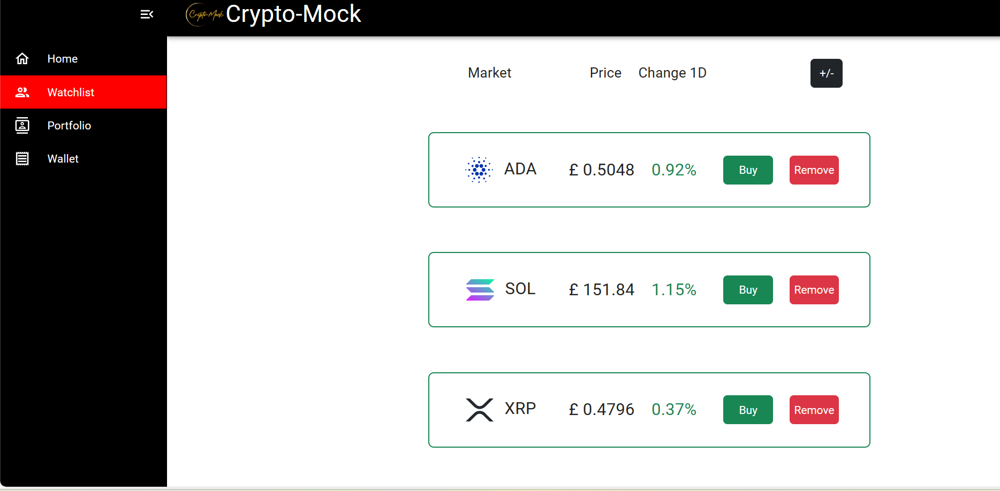

# Crypto-Mock

## Description

This [project](https://jocular-youtiao-8f6012.netlify.app/) mocks a cryptocruncy exchange website and builds a platform using React and various React-based libraries. Within the application, users can navigate through four main pages:

### Pages

**Home:** Displays concise information on supported cryptocurrencies, including prices and daily percentage changes. Users can conveniently monitor multiple currencies at a glance.

**Watchlist:** Allows users to customize their watchlist by adding or removing cryptocurrencies, facilitating personalized tracking.

**Portfolio:** Offers a view of purchased items, enabling users to manage their investments efficiently.

**Wallet:** Keeps track of invested funds, providing users with insights into their financial activities within the platform.

### Used Libraries

To enhance functionality and user experience, we have leveraged the following libraries:

[SWR](https://swr.vercel.app/): Utilized for fetching real-time data on cryptocurrency prices and daily price changes, ensuring users have access to up-to-date information.

[React Bootstrap](https://react-bootstrap.github.io/): Integrated to streamline UI development, enabling responsive and visually appealing design elements.

[Material UI](https://mui.com/material-ui/) Employed to enhance the aesthetics and usability of the application, offering a modern and cohesive user interface.

[UUID](https://www.npmjs.com/package/uuid)  The uuid package provides functionality for generating unique id number in a format of cryptographically secure standard UUIDs. 

Below figure shows a screenshot from the running application.

<figure>

<figcaption><em>Figure.1. Crypto-Mock application</em></figcaption>
</figure>

## Installation

N/A

## Credits

The following resources were used.

* https://www.w3schools.com
* https://developer.mozilla.org
* [Bootstrap Documentation](https://getbootstrap.com/docs/4.0/getting-started/introduction/)
* [React Documentation](https://react-bootstrap.github.io/docs/getting-started/introduction)
* [Material UI Documentation](https://mui.com/material-ui/getting-started/)
* [SWR Documentation](https://swr.vercel.app/docs/getting-started)
* [React Bootstrap Documentation](https://react-bootstrap.github.io/docs/getting-started/introduction)

## License

Please refer to the [LICENSE](./LICENSE) file.
